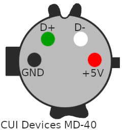
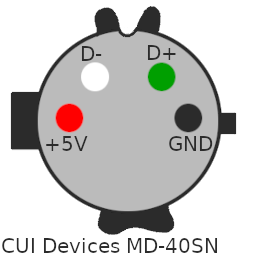

# Assembly of Cables

## USB -> Case

### 1. Solder USB wires to the CUI Devices MD-40 (Male Mini-DIN 4 position plug) as shown.

This image is looking at the solder-side of the connector. Pay careful attention to the size and shapes of the registering pins around the circumference of the connector.

### 2. Solder USB wires to the USB connector.

## Case -> Micro-Controller

### 1. Solder USB wires to the USB data pads of the micro controller.

### 2. Solder USB wires to the CUI Devices MD-40SN (Female Mini-DIN 4 position receptacle) as shown.

